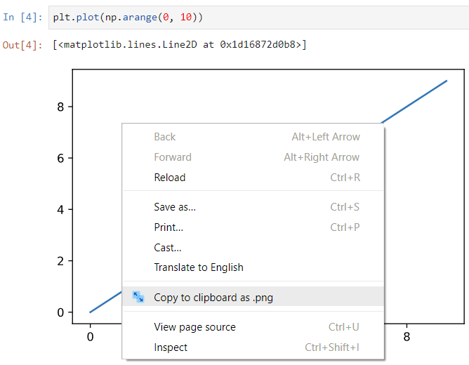

README
======

This is a Chrome extension allowing you to copy SVG image from website into a clipboard in PNG format compatible with Microsoft Office suite. This is intended to be used in Windows only.

It has been done because I often want to copy&paste plots from Jypyter (Lab) running on Chrome into some presentations, and Chrome is missing SVG copy functionality.

Structure
---------

It consists of two parts:

[SVG2PNG]: https://github.com/pedro380085/SVG2PNG
[Jupyter]: http://jupyter.org/

1. Chrome extension based on [SVG2PNG][SVG2PNG] code.

   

   *NOTE: For [Jupyter][Jupyter] or JupyterLab use `%config InlineBackend.figure_format = "svg"` to switch to SVG Matplotlib backend. This may improve your notebook sizes and make them resolution independent.*

2. Chrome Native Messaging host written in python.

Installation
------------

1. Chrome extension can be installed using developer mode via `chrome://extensions/`.

2. Native messaging host can be installed via `host/install_host.bat`

License
-------

Released under MIT license, see [LICENSE](LICENSE).
